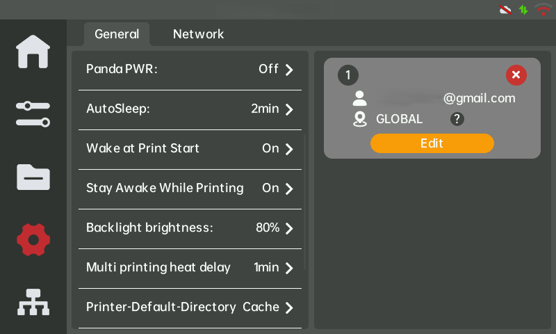
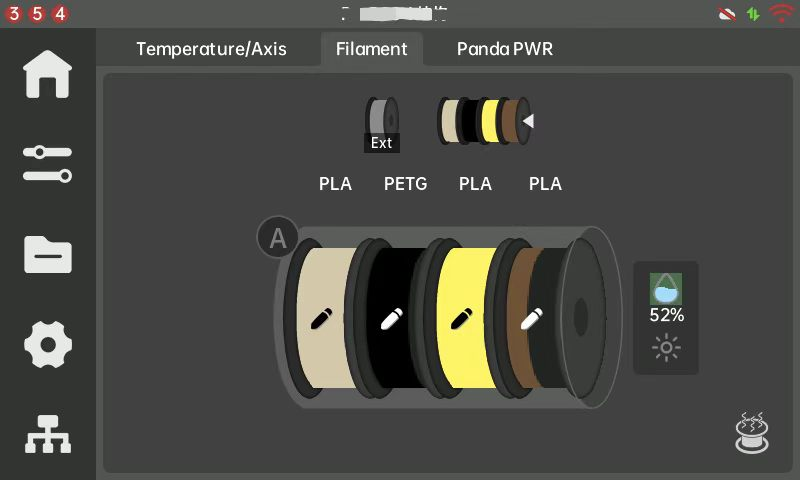
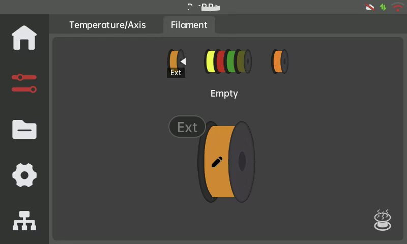
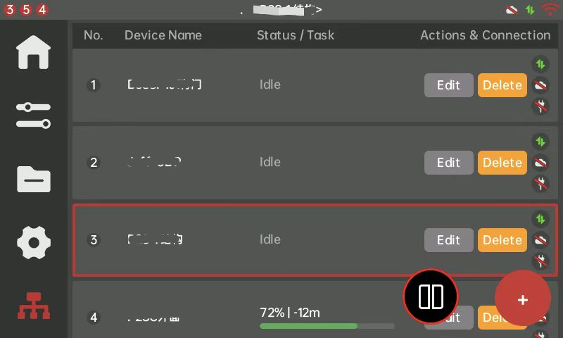
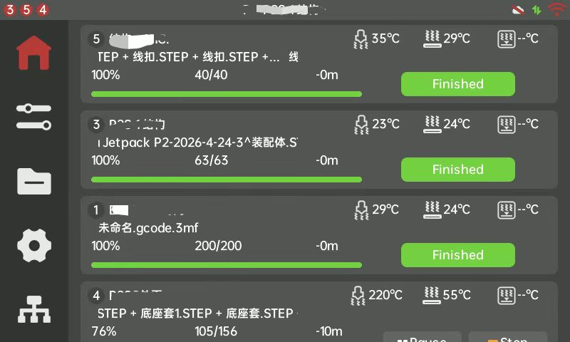
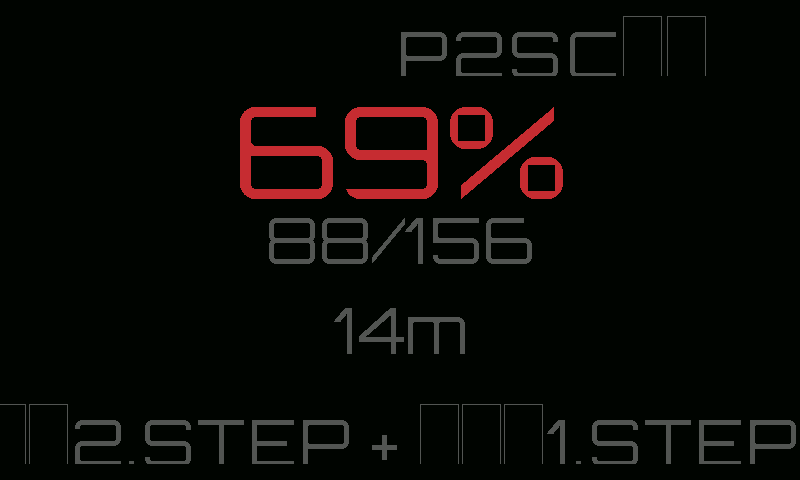
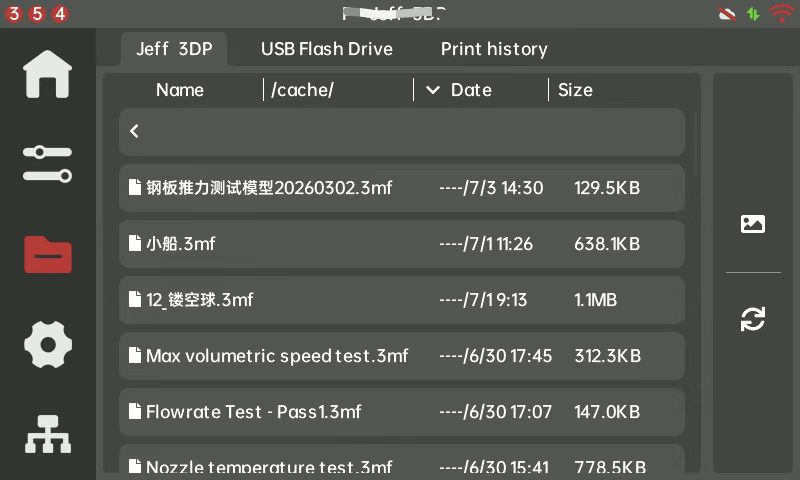
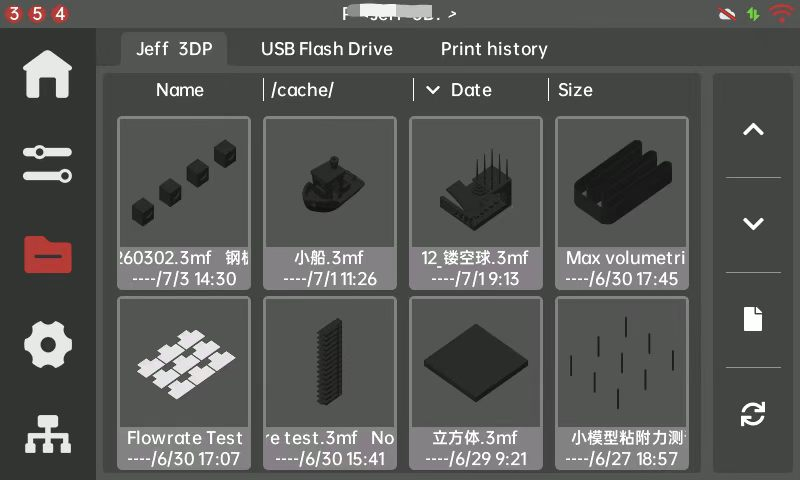
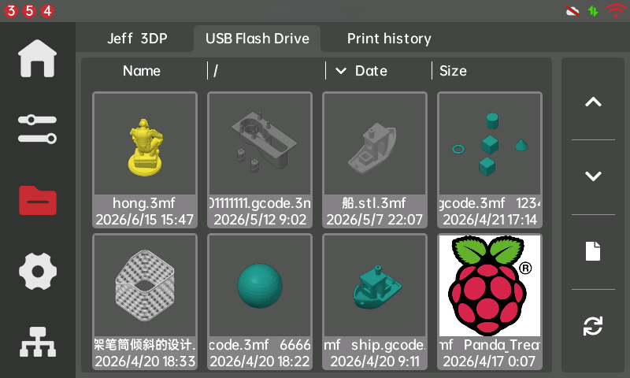

# 🐼 PandaTouch 固件发布 v1.0.8.0

## 📖 概览

本次发布面向所有用户，重点提升 **系统稳定性**、**OTA 可靠性**、**AMS 支持** 以及 **UI/UX 体验**。

### ✨ 主要亮点

- 重新设计 AMS 界面，槽位布局和状态显示更清晰
- 重构了耗材管理界面以及耗材管理逻辑
- 改进 AMS2 / AMS-HT 识别逻辑
- 新增打印机 / 分组列表视图模式
- 优化打印唤醒行为，打印任务进行中设备会保持唤醒
- 打印运行时新增屏幕保护模式
- 修复休眠 / 唤醒导致的崩溃和连续重启问题
- 重构文件管理界面，优化文件管理逻辑和缩略图显示
- 修复登录 BBL 云账户时导致的设备重启问题
- 改进 Wi-Fi 兼容性（WPA2 / WPA3）
- OTA IMG 更新流程增加校验，并优化更新过程中的稳定性
- 更新 HMS 通知提示并添加新的通知提示信息

---

## 📋 更新日志

### 🔧 Bug Fixes

- 修复休眠 / 唤醒崩溃导致的连续重启问题  
  [https://github.com/bigtreetech/PandaTouch/issues/260](https://github.com/bigtreetech/PandaTouch/issues/260)

- 修复频繁短周期重启问题 / 修复设备在唤醒或打印开始后进入重启循环的问题  
  [https://github.com/bigtreetech/PandaTouch/issues/328](https://github.com/bigtreetech/PandaTouch/issues/328)

- OTA IMG 更新流程增加校验，并优化更新过程中的稳定性，降低刷写过程中途失败的概率  
  [https://github.com/bigtreetech/PandaTouch/issues/327](https://github.com/bigtreetech/PandaTouch/issues/327)

- 修复 AMS2 / AMS-HT 搜索与识别逻辑  
  [https://github.com/bigtreetech/PandaTouch/issues/332](https://github.com/bigtreetech/PandaTouch/issues/332)

- 修复外置料架加载逻辑，确保进料 / 退料操作正常

- 解决外置料架刷新和 AMS 槽位映射问题，确保槽位状态正确显示  
  [https://github.com/bigtreetech/PandaTouch/issues/313](https://github.com/bigtreetech/PandaTouch/issues/313)

- 增强 WPA2 / WPA3 Wi-Fi 兼容性  
  [https://github.com/bigtreetech/PandaTouch/issues/331](https://github.com/bigtreetech/PandaTouch/issues/331)

- 修复登录 BBL 云账户时导致的设备重启问题

### 🚀 Functional Optimizations

- 优化打印唤醒行为，打印任务进行中设备保持唤醒状态

- 重新设计固件警告流程，使恢复路径更清晰  
  [https://github.com/bigtreetech/PandaTouch/issues/333](https://github.com/bigtreetech/PandaTouch/issues/333)

- 优化固件更新期间的警告提示体验

- 重新设计 AMS 界面，槽位布局和状态显示更清晰

- 重构了耗材管理界面以及耗材管理逻辑

- 新增打印机和分组列表视图模式  
  [https://github.com/bigtreetech/PandaTouch/issues/92](https://github.com/bigtreetech/PandaTouch/issues/92)

- 优化进料 / 退料操作流程中的步骤提示

- 优化警告弹窗

- 打印运行时新增屏幕保护模式，在打印运行时保护屏幕不被误操作

- 重构文件管理界面，优化文件管理逻辑和缩略图显示逻辑  
  [https://github.com/bigtreetech/PandaTouch/issues/276](https://github.com/bigtreetech/PandaTouch/issues/276)

- 更新通知提示并添加新的通知提示信息

---

## 🔄 更新方式

固件更新说明：

- [https://global.bttwiki.com/PandaTouch.html#how-to-update-firmware](https://global.bttwiki.com/PandaTouch.html#how-to-update-firmware)
